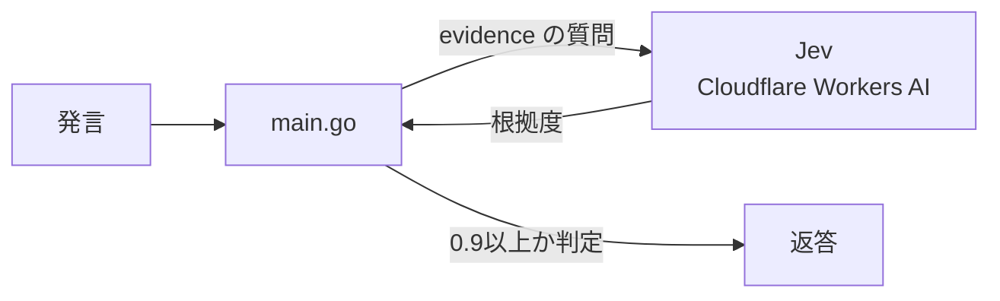

# kansou-jev

「それってあなたの感想ですよね？」と言ったり言わなかったりするプログラム(Go × Jev)

## HowToUse

```bash
git clone git@github.com:ibukiyama2022/kansou-jev.git
cd kansou-jev

export CLOUDFLARE_ACCOUNT_ID=...
export CLOUDFLARE_API_TOKEN=...

go run main.go "このラーメン、絶対うまいって。並んでるし"
```

**出力例**

```
evidence=0.10
それってあなたの感想ですよね？
```

## 料金(2026-10-06 時点)

[typesafe/jev の料金](https://developers.cloudflare.com/ai/models/typesafe/jev/)

| 項目 | 単価 |
| --- | --- |
| 入力 | $0.042 / 100万トークン |
| 出力 | $0.00 |
| キャッシュ入力 | $0.00 |

## 構成


